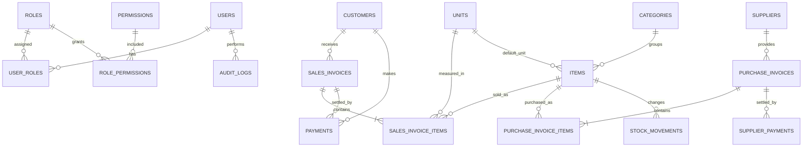

# Database ERD (Logical)

```mermaid
erDiagram
    USERS ||--o{ USER_ROLES : has
    ROLES ||--o{ USER_ROLES : assigned
    ROLES ||--o{ ROLE_PERMISSIONS : grants
    PERMISSIONS ||--o{ ROLE_PERMISSIONS : included

    CUSTOMERS ||--o{ SALES_INVOICES : receives
    SALES_INVOICES ||--|{ SALES_INVOICE_ITEMS : contains
    ITEMS ||--o{ SALES_INVOICE_ITEMS : sold_as
    UNITS ||--o{ SALES_INVOICE_ITEMS : measured_in
    SALES_INVOICES ||--o{ PAYMENTS : settled_by
    CUSTOMERS ||--o{ PAYMENTS : makes

    SUPPLIERS ||--o{ PURCHASE_INVOICES : provides
    PURCHASE_INVOICES ||--|{ PURCHASE_INVOICE_ITEMS : contains
    ITEMS ||--o{ PURCHASE_INVOICE_ITEMS : purchased_as
    PURCHASE_INVOICES ||--o{ SUPPLIER_PAYMENTS : settled_by

    CATEGORIES ||--o{ ITEMS : groups
    UNITS ||--o{ ITEMS : default_unit
    ITEMS ||--o{ STOCK_MOVEMENTS : changes
    USERS ||--o{ AUDIT_LOGS : performs
```

This diagram is conceptual. The physical schema and optional relationships must be finalized in migrations.
